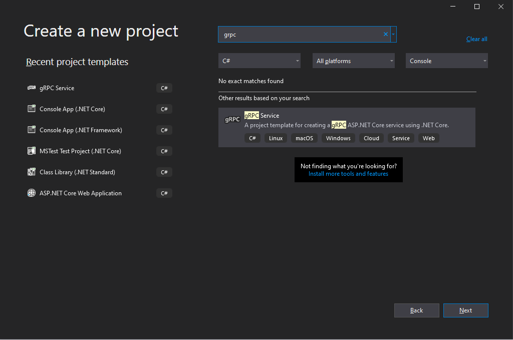
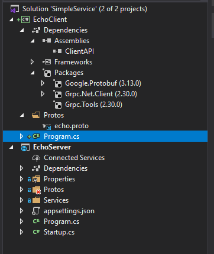
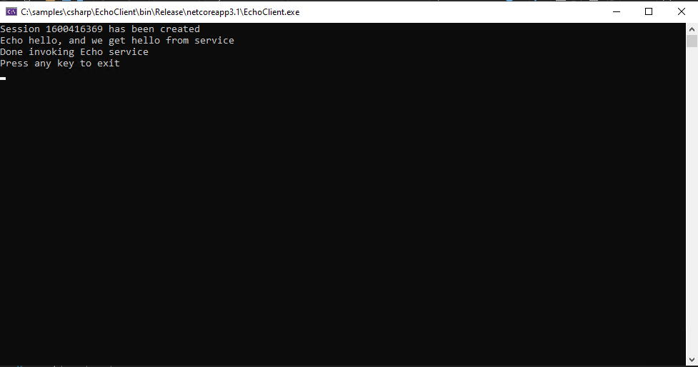
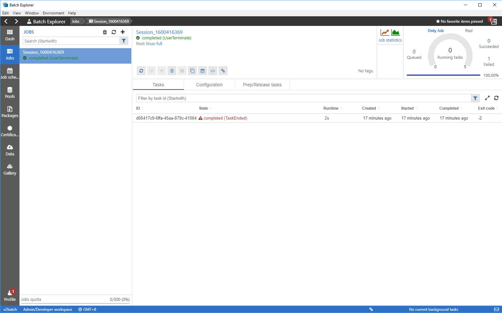

# Microsoft Telepathy Tutorial – Write your first SOA service and client

This series of tutorial introduces the SOA programming model for Microsoft Telepathy . This is the first tutorial of the series and provides guidance to write your first SOA service and client. 

## Getting started

Let's say we need a service running on the Telepathy cluster to echo the requests. Then we need a Telepathy client program to submit the echo requests to the service and returns the result to the end users. 

Here are the steps to write a SOA application in c#:

- Step 1: Define the proto

- Step 2: Implement the service

- Step 3: Deploy the service

- Step 4: Implement the client

- Step 5: Test the service

### Step 1: Define the proto
Following code can be found in the [sample protos](../samples/protos/).

A SOA service is a [gRPC](https://grpc.io/) service running on the Telepathy cluster. The SOA service is ideal for writing interactive, embarrassingly parallel applications, especially for calculation of complex algorithms.

The first step to run a Telepathy service is to define the proto file based on [Protocol Buffers](https://developers.google.com/protocol-buffers):
```protobuf
service Echo {
  rpc Echo (EchoRequest) returns (EchoReply);
}

message EchoRequest {
  string message = 1;
  int32 delayTime = 2;
  bytes dummydata = 3;
}

message EchoReply {
  string message = 1;
}
```
 The proto include message definition, gRPC service and method definition. Save the file with name `echo.proto`.

### Step 2: Implement the service

Following codes can be found in the [sample codes](../samples/csharp/). 

A SOA service does not require too much extra effort beyond your algorithm. It’s just a standard gRPC service. You can use **gRPC Service** project template in **Visual Studio 2019** with **ASP.NET and web development** to implement the cross-platform gRPC service. 
1. Start Visual Studio and select **Create a new project**. 
2. In the dialog, search "gRPC" and select **gRPC Service** option on the right and select **Next**:



3. Name the project **EchoServer** and select **Create**.
4. In the **Create a new gRPC service dialog**, select **Create**.
5. In the `EchoServer` project, expand `Protos` folder and replace the pre-created `greeter.proto` with `echo.proto` saved in Step1.
6. Expand `Services` folder and rename the file `GreeterService.cs` to `EchoService.cs`. Select `EchoService.cs`. Replace all the `GreeterService` to `EchoService` and `Greeter.GreeterBase` to `Echo.EchoBase`. Delete the `SayHello` method and implement your own `Echo` method which is defined in `echo.proto` with the following codes:

```csharp
public override async Task<EchoReply> Echo(EchoRequest request, ServerCallContext context)
        {
            await Task.Delay(request.DelayTime);
            return new EchoReply
            {
                Message = request.Message
            };
        }
```

7. Select `Startup.cs`. Replace the line `endpoints.MapGrpcService<EchoService>();` in `Configure` method to:

```csharp
endpoints.MapGrpcService<EchoService>();
```

8. Select `Program.cs`. Bind your service to **"TELEPATHY_SVC_PORT"** environment varibale defined port in `CreateHostBuilder` method.

```csharp
public static IHostBuilder CreateHostBuilder(string[] args) =>
            Host.CreateDefaultBuilder(args)
                .ConfigureWebHostDefaults(webBuilder =>
                {
                    webBuilder.UseStartup<Startup>();
                    // Add these two lines to read the port from environment variable.
                    var port = int.Parse(Environment.GetEnvironmentVariable("TELEPATHY_SVC_PORT"));
                    webBuilder.UseUrls($"http://0.0.0.0:{port}");
                });
```

You **must** read the port value from `TELEPATHY_SVC_PORT` environment variable and bind your service to that specific value so that tasks can be sent to your server successfully.

### Step 3: Deploy the service

After implementing your own `echo service`, we need to deploy the service to Telepathy cluster. Before we deploy the service, we need to create the service configuration file. Create an JSON file like the following:
```json
{
    "ServiceTimeout": 3000,
    "ServiceConcurrency": 1,
    "PrefetchCount": 10,
    "ServiceFullPath": "echo\\EchoServer.dll",
    "ServiceInitializeTimeout": 0,
    "ServiceLanguage": "csharp"
 }
```

The `"ServiceFullPath"` and "`ServiceLanguage`" **must** be filled and the others are optional parameters. Microsoft Telepathy now support **csharp**, **python** and **java** language which must be specified in "`ServiceLanguage`" parameter. If you use `Windows` operation system as the compute node, you can use both DLL file and EXE file while only DLL file is supported on `Linux` compute nodes. Note that the name of the JSON file must be as same as the service name, and must be lowercase. In this case, name it `echo.json`.

Now copy the service configuration file to the configuration blob container, which is a blob container named **service-registration** in the Azure Storage Account linked to your Telepathy cluster. Next step is to create a folder `echo` in **service-assembly** container in the same Storage Account, and copy the DLL file (and EXE file if you specify it in service configuration file.) into the folder. You can use tools like [Azure Storage Explorer](https://azure.microsoft.com/en-us/features/storage-explorer/) to access both two containers. 

### Step 4: Implement the client

Following code can be found in the Client project in the [sample code](../samples/csharp). 

Now we need a client program to submit the echo request. The client needs to invoke the service we just created remotely, so we need to leverage GRPC to generate the client code for us. Grpc tool can simplify the whole process by compiling specific .proto.

**Important**: Ensure that **echo.proto** is same in both server side and client side. We suggest that both sides refer the .proto link.

The suggested project organization in Visual Studio is to create different projects for the service and client programs, as shown in the following figure:



Now we can write the client code:

1. Reference `Grpc.Tools`, `Google.Protobuf`, and `Grpc.Net.Client` Nuget package in the client project.

1. Add reference `ClientAPI.dll` after building [ClientAPI project](../client/ClientAPI) to the client project.

1. Add file `echo.proto` to the project and set its build action as **Protobuf compiler**.

1. Prepare the session info, which includes the frontend address (telepathy system entrance) and the service name. Let’s assume the head node host name is head.contoso.com and we are using the Echo service.

    ```csharp
    SessionStartInfo info = new SessionStartInfo("head.contoso.com:9100", "Echo");
    ```

1. With the SessionStartInfo object we can create a session to connect to the telepathy system.

   ```csharp
   using (Session session = await Session.CreateSessionAsync(info)) {……}
   ```

1. To be able to send tasks and receive results, you need to create a BatchClient object with the method.

   ```csharp
   using (Session session = await Session.CreateSessionAsync(info))
   {
       using (var client = new BatchClient(session, Echo.Descriptor.FindMethodByName("Echo"))){……}
   }
   ```

1. With the BatchClient, you can send tasks and receive results.

   ```csharp
   using (var client = new BatchClient(session, Echo.Descriptor.FindMethodByName("Echo")))
   {
       //send task
       var request = new EchoRequest{ Message = "hello" };
       client.SendTask(request);
       await client.EndTasksAsync();

       //get result
      await foreach (var result in client.GetResultsAsync<EchoReply>())
      {
         Console.WriteLine("Echo hello, and we get {0} from service", result.Message);
      }
   }
   ```
### Step 5: Test the service

Now you can test your service using your client program.

Run the client in the Visual Studio. If everything is working fine, you should see output like the following:




By default we use Azure Batch Service as our backend. You can see the corresponding batch job through [Batch Explorer](https://azure.github.io/BatchExplorer/) or [Azure Portal](https://portal.azure.com/).



Congratulations! You have successfully created and run your first SOA service.